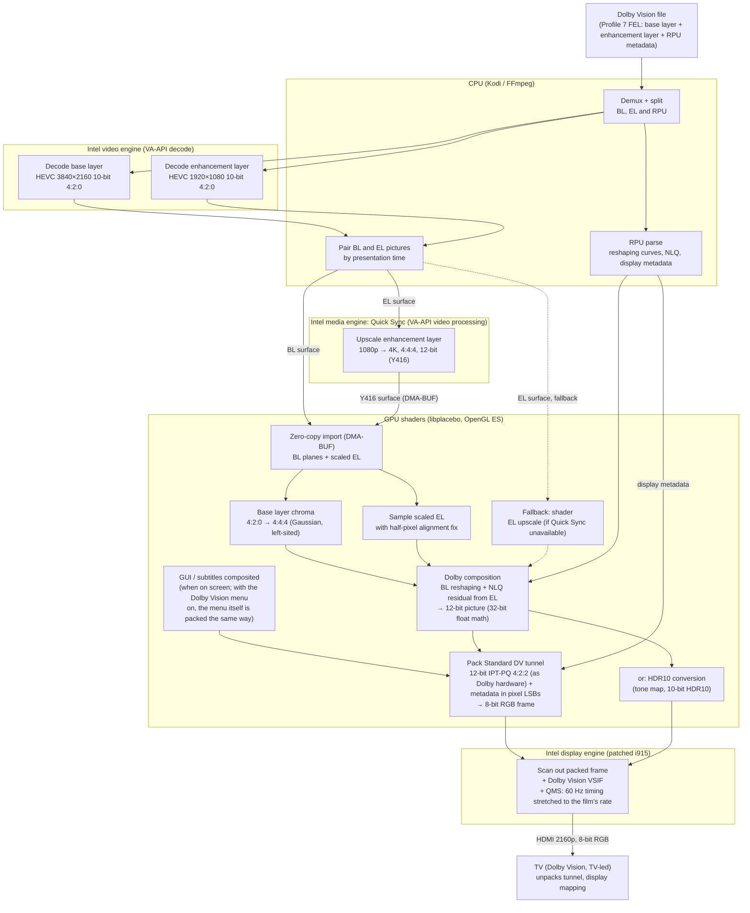

# LibreELEC yblod

**An unofficial LibreELEC build with experimental Dolby Vision processing for Intel HDMI systems.**

yblod is a personal LibreELEC build for Intel PCs. It is **not** an official
LibreELEC release and is not affiliated with or supported by LibreELEC, Kodi, Dolby or Intel.
Please report problems here, not to those projects.
This project is not Dolby-certified. Hardware comparisons do not establish
Dolby compliance, endorsement, or a grant of patent or technology licenses.

The `experiment/dv-reconstruction` branch also contains a separate
[offline reconstruction reference](tools/yblod/reference/README.md). It is not
yet a replacement for the playback engine described below. Its tests use
documented arithmetic and explicitly labelled experiments, with no fitted
hardware-matching offsets; remaining discrepancies are published.

## What it is

- **LibreELEC master** (Kodi 22), pinned to a known commit and updated deliberately.
- **CroqueMr's Intel Dolby Vision engine** ([CroqueMr/intel-dv-libreelec](https://github.com/CroqueMr/intel-dv-libreelec)):
  Standard (TV-led) Dolby Vision output from Kodi's own player, including Profile 7 FEL, on supported Intel GPUs.
- **Experimental video processing evaluated with documented tests and hardware-output comparisons**:
  IPT transport, chroma positioning, co-sited 4:2:2 packing and Gaussian chroma
  upsampling in the existing playback engine. Some historical choices were
  fitted to sampled hardware output, not independently established as correct
  Dolby processing; see the method and limitations below.
- **Quick Sync enhancement-layer offload**: Profile 7 FEL playback scales the
  enhancement layer on the Intel media engine (Quick Sync, via VA-API) instead of in shaders. On an
  i5-1135G7 this cut GPU render load during FEL playback from about 46% to about 12%, with no dropped
  frames in the measured scenes and small measured signal differences from the
  shader path in those comparisons. This is not a general accuracy guarantee. It is aimed at
  making FEL playable on smaller Intel GPUs. It can be switched off, and falls back to the shader path
  automatically when the media engine or driver can't do it.
- **Seamless refresh rate changes (QMS-VRR)**: on TVs with HDMI 2.1 Quick Media Switching, a change between
  24, 25, 30, 50 and 60 Hz (and 23.976, 29.97, 59.94) no longer blanks the screen (see below).
- **Dolby Vision menu** (optional): the menu is sent in Dolby Vision too, so a Dolby Vision film starts without
  the TV switching picture format. With QMS, starting and stopping a Dolby Vision film causes no blackout at all.
- **Extra fixes** on top of that engine:
  - one HDMI mode change per Dolby Vision start/stop, instead of several
  - audio engine handles a lost/reset display in every state (fewer silent-audio cases)
  - black picture fixed on live 10-bit TV channels decoded with VAAPI
- **Updates come from this repository only.** The LibreELEC update settings list yblod releases
  (Settings > LibreELEC > Updates). The automatic check never offers official LibreELEC builds, so an
  update cannot silently replace this build. Add-ons still come from the normal LibreELEC add-on repository.

## Performance

GPU load during 4K Dolby Vision playback on an Intel Core i5-1135G7 (Iris Xe), per Quick Sync scaling
setting. *Render* is the GPU shader load, *media engine* is Quick Sync's video-processing unit (otherwise idle
during playback). Same scene for each row, no dropped frames in any case.

| Content | Off | Enhancement layer (default) | Enhancement layer and colour |
|---|---|---|---|
| Profile 7 FEL (*Saving Private Ryan*) | render 45.8% | render **12.1%**, media engine 11.2% | render **10.6%**, media engine 22.3% |
| Profile 8.1 (*28 Years Later: The Bone Temple*) | render 22.9% | render 23.1% (no enhancement layer) | render **6.3%**, media engine 11.2% |

*Enhancement layer* removed about three quarters of the render-engine load in this
FEL measurement, with small measured signal differences from the shader path.
*Enhancement layer and colour* also moves base layer colour upsampling to the media engine, which helps every
Dolby Vision profile; colour edges are slightly less close to Dolby hardware in that mode (see below).

## Historical hardware-output comparisons

yblod's existing playback output was compared with Ugoos AM9 Pro and SK4 Pro
(Amlogic, TV-led) captures. The following historical figures are from **four
matched frames of one Profile 8.1 clip against the AM9 Pro**, not a general result
for Profile 7 FEL, all movies, both devices, or the new standalone reference.
They include the playback engine's fitted offset. Units are 12-bit PQ codes after
conversion into a common comparison colour space:

| | Original engine | yblod |
|---|---|---|
| Median pixel difference (12-bit PQ codes) | 4.37 | **0.72** |
| Pixels within 4 codes | 42.5% | **97.9%** |
| Colour edges (RMS) | 16.4 | **3.4** |

These figures measure agreement with a particular captured output, not absolute
colour accuracy or a visibility threshold. The hardware is a useful cross-check,
not the definition of correct processing. New Profile 7 experiments expose
remaining disagreements and show that a closer match on one frame does not prove
a generally correct rule. Details, historical fitting choices, and current
acceptance criteria: [docs/yblod/ACCURACY.md](docs/yblod/ACCURACY.md).

## Seamless refresh rate changes (QMS)

Normally a refresh rate change (60 Hz menu to a 23.976 Hz film) is a new HDMI mode, and the TV blanks for a
second or more. HDMI 2.1 Quick Media Switching avoids that: the source keeps the 60 Hz timing and only lengthens
the blank interval between frames, and announces the new rate to the TV beforehand, so the TV changes rate
without losing the picture.

yblod does this in the kernel when the TV supports QMS (read from the TV's EDID; nothing to set):

- 1920x1080 and 3840x2160 at 23.976, 24, 25, 29.97, 30, 47.95, 48, 50, 59.94 and 60 Hz.
- SDR and Dolby Vision. HDR10 and other deep colour output keeps its own timing (at 2160p the 60 Hz link has no
  room for 10-bit colour), so those still switch normally.
- Tested on an LG TV with an Intel Core i5-1135G7. It can be turned off with the kernel option `i915.qms=0`.

Kodi chooses refresh rates from the whitelist (Settings > System > Display > Whitelist). Left empty, Kodi uses
every rate the TV reports at the desktop resolution, which is the best choice with QMS.

## Dolby Vision settings

Player > Videos > Dolby Vision:

- **Quick Sync scaling**: *Enhancement layer* (default) upscales the Profile 7 FEL enhancement layer on the
  Intel media engine; *Enhancement layer and colour* also upsamples base layer colour there (lighter on the
  GPU, with larger measured differences at colour edges in the tested captures);
  *Off* uses the GPU shaders only.
- **Match Dolby hardware levels** (default on in the existing playback engine):
  applies the historical fitted offset. Its underlying cause is not established;
  it is not a Dolby-defined correction. The standalone reference does not use it.
- **Dolby Vision for the menu** (default off): keeps the Dolby Vision output on while the menu is shown, so
  Dolby Vision films start and stop without the TV switching picture format. Needs a 3840x2160 desktop.
- **Menu brightness, saturation, gamma and wide colour** (menu only): how the Dolby Vision menu looks. Brightness
  sets menu white from 203 nits (HDR reference white, as the on-screen display over films) to 800 nits
  (default 400); saturation 80-150%; gamma sRGB, 2.2 or 2.4 for more contrast; wide colour shows the menu on the
  TV's full colour range, like a vivid mode. Films and the on-screen display over films are never affected.

## How playback works

Where each part of a Dolby Vision Profile 7 FEL picture is processed, and how it comes back together:

| Part | Runs on | Notes |
|---|---|---|
| Demux, layer split, RPU parse, BL/EL pairing | CPU | light work |
| Base layer decode (4K) | Intel video engine | hardware HEVC |
| Enhancement layer decode (1080p) | Intel video engine | second hardware decoder |
| **Enhancement layer upscale 1080p → 4K** | **Intel media engine (Quick Sync)** | yblod; falls back to GPU shaders automatically |
| Base layer chroma upsample | GPU shaders | or the media engine with Quick Sync scaling set to *Enhancement layer and colour* |
| Dolby composition (reshaping + NLQ) | GPU shaders | no Intel hardware for this |
| Standard DV tunnel packing, or HDR10 conversion | GPU shaders | |
| Scan-out, Dolby VSIF, QMS refresh rate changes | Intel display engine | patched i915 |
| Display mapping | TV | TV-led Dolby Vision |

Profile 8.1 and other single-layer content skip the enhancement-layer branch.
Subsequent colour processing uses GPU shaders, except base-colour media-engine
offload when enabled; final scanout remains the display pipeline's job.

## Install

Download the `.tar` from [Releases](https://github.com/dangerouslaser/libreelec-yblod/releases), copy it to the
`Update` share (`/storage/.update`) of an existing LibreELEC x86_64 install and reboot. Fresh installs use the
`.img.gz` the same way as LibreELEC's own images.

## Build

The build runs in LibreELEC's Docker build environment. `tools/yblod/build.sh <version>` builds an image with
a memory cap (see the script for details).

## Branches and releases

How this repository tracks LibreELEC and how releases are made: [docs/yblod/BRANCHES.md](docs/yblod/BRANCHES.md).

## Source and licences

Everything needed to rebuild a release is public: this repository (LibreELEC plus all changes) at the release
tag, and the upstream source archives it downloads. The Dolby Vision engine's documentation, licences and
notices are kept in [docs/intel-dv](docs/intel-dv) and licenses/ (files prefixed `intel-dv-`). LibreELEC's own
licences are in [licenses](licenses).

Dolby, Dolby Vision and the double-D symbol are trademarks of Dolby Laboratories. LibreELEC is a trademark of
Team LibreELEC; this project is independent.
