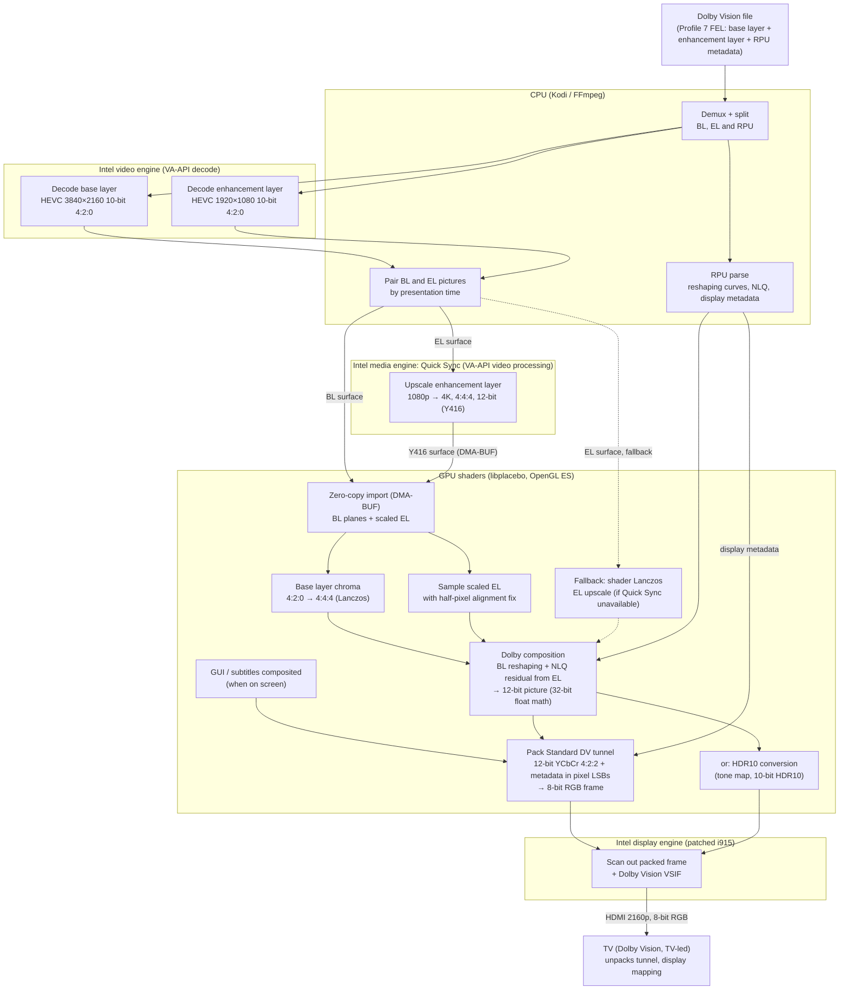

# LibreELEC yblod

**An unofficial LibreELEC build with native Dolby Vision for Intel HDMI systems.**

yblod is a personal LibreELEC build for Intel PCs. It is **not** an official
LibreELEC release and is not affiliated with or supported by LibreELEC, Kodi, Dolby or Intel.
Please report problems here, not to those projects.

## What it is

- **LibreELEC master** (Kodi 22), pinned to a known commit and updated deliberately.
- **CroqueMr's Intel Dolby Vision engine** ([CroqueMr/intel-dv-libreelec](https://github.com/CroqueMr/intel-dv-libreelec)):
  Standard (TV-led) Dolby Vision output from Kodi's own player, including Profile 7 FEL, on supported Intel GPUs.
- **Extra fixes** on top of that engine:
  - one HDMI mode change per Dolby Vision start/stop, instead of several
  - audio engine handles a lost/reset display in every state (fewer silent-audio cases)
  - black picture fixed on live 10-bit TV channels decoded with VAAPI
- **Quick Sync enhancement-layer offload** (in development for 0.1): Profile 7 FEL playback scales the
  enhancement layer on the Intel media engine (Quick Sync, via VA-API) instead of in shaders. On an
  i5-1135G7 this cut GPU render load during FEL playback from about 53% to about 13%, with no dropped
  frames, and the HDMI output stays within about one 12-bit code of the shader path. It is aimed at
  making FEL playable on smaller Intel GPUs. It can be switched off, and falls back to the shader path
  automatically when the media engine or driver can't do it.
- **Updates come from this repository only.** The LibreELEC update settings list yblod releases
  (Settings > LibreELEC > Updates). The automatic check never offers official LibreELEC builds, so an
  update cannot silently replace this build. Add-ons still come from the normal LibreELEC add-on repository.

## How playback works

Where each part of a Dolby Vision Profile 7 FEL picture is processed, and how it comes back together:

| Part | Runs on | Notes |
|---|---|---|
| Demux, layer split, RPU parse, BL/EL pairing | CPU | light work |
| Base layer decode (4K) | Intel video engine | hardware HEVC |
| Enhancement layer decode (1080p) | Intel video engine | second hardware decoder |
| **Enhancement layer upscale 1080p → 4K** | **Intel media engine (Quick Sync)** | yblod; falls back to GPU shaders automatically |
| Base layer chroma upsample | GPU shaders | the media engine only replicates chroma when not scaling, so this stays in shaders |
| Dolby composition (reshaping + NLQ) | GPU shaders | no Intel hardware for this |
| Standard DV tunnel packing, or HDR10 conversion | GPU shaders | |
| Scan-out + Dolby VSIF | Intel display engine | patched i915 |
| Display mapping | TV | TV-led Dolby Vision |

Profile 8.1 and other single-layer content skip the enhancement-layer branch; everything after decode runs
in the GPU shaders.

## Install

Download the `.tar` from [Releases](https://github.com/dangerouslaser/libreelec-yblod/releases), copy it to the
`Update` share (`/storage/.update`) of an existing LibreELEC x86_64 install and reboot. Fresh installs use the
`.img.gz` the same way as LibreELEC's own images.

## Build

The build runs in LibreELEC's Docker build environment. `tools/yblod/build.sh <version>` builds an image with
a memory cap (see the script for details).

## Source and licences

Everything needed to rebuild a release is public: this repository (LibreELEC plus all changes) at the release
tag, and the upstream source archives it downloads. The Dolby Vision engine's documentation, licences and
notices are kept in [docs/intel-dv](docs/intel-dv) and [licenses/intel-dv](licenses/intel-dv). LibreELEC's own
licences are in [licenses](licenses).

Dolby, Dolby Vision and the double-D symbol are trademarks of Dolby Laboratories. LibreELEC is a trademark of
Team LibreELEC; this project is independent.
